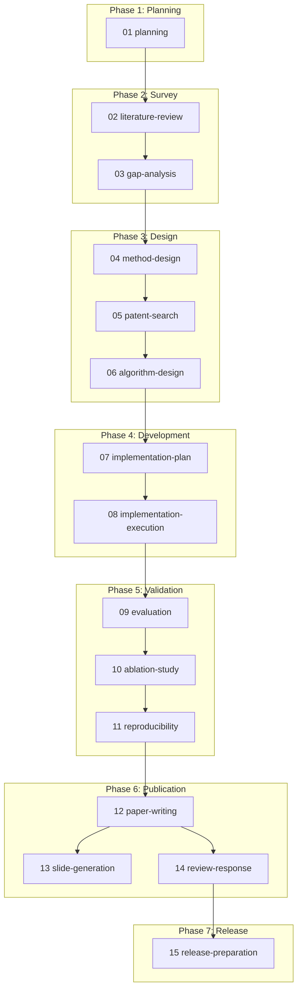

# cc-research

Claude Code 上で研究プロジェクトを進めるための **Skills 集**です。
研究テーマの企画から、文献調査、手法設計、実装、評価実験、論文執筆、発表資料作成、査読対応、成果公開まで、
研究のライフサイクル全体を 15 個のスキルとしてカバーしています。

## これは何か

Claude Code は `.claude/skills/` 配下に `SKILL.md` を置くことで、特定の作業手順をスラッシュコマンド
(例: `/research-01-planning`)として呼び出せるようになります。本プロジェクトはこの仕組みを使い、
「研究の各フェーズで何を考え、何を確認し、何を成果物として残すべきか」を Skill として体系化したものです。

単なるテンプレートではなく、各スキルには次のような研究実務上の勘所を組み込んでいます:

- **前段の成果物を必ず参照する**: 各スキルは開始時に `research/STATUS.md` と前フェーズの成果物を読み、
  文脈を引き継いでから作業する
- **引用・数値の裏取りを徹底する**: 文献調査や論文執筆では、検索で実在を確認できた文献のみを引用し、
  記憶からの捏造を防ぐ
- **実験は事前登録してから実施する**: 評価実験・アブレーションでは、結果を見る前に実験計画
  (シード数・統計検定・評価条件)を確定させる
- **コスト最適化**: スキルごとに要求される知的水準が異なるため、使用モデル(Opus / Sonnet / Haiku)を
  スキル単位で使い分ける
- **並行書き込みを避ける**: サブエージェントや並列ジョブに作業を分担させる場合でも、
  `research/` 配下などの成果物ファイルへの書き込みは常に本体(スキルを実行している自分自身)が
  単独・逐次で行う。サブエージェントは調査・実行結果を回答テキストとして返すだけにとどめ、
  複数の書き手が同一ファイルに同時に書き込んで内容を上書き・破損させる競合を防ぐ

## セットアップ

このリポジトリを Claude Code のプロジェクトディレクトリとして開くか、`.claude/skills/` 配下を
既存プロジェクトにコピーしてください。Claude Code はプロジェクト内の `.claude/skills/*/SKILL.md` を
自動的に検出し、スラッシュコマンドとして利用可能にします。

```
your-project/
    .claude/
        skills/
            research-01-planning/SKILL.md
            research-02-literature-review/SKILL.md
            ...
```

## 使い方

研究テーマが決まったら、まず計画スキルを呼び出します。

```
/research-01-planning バッテリー劣化予測のための時系列モデルを研究したい
```

以降は `/research-02-literature-review` → `/research-03-gap-analysis` → … と、パイプラインの順に
呼び出していくのが基本の流れです。ただし各スキルは前段の成果物が無くても、不足している情報を
質問した上で単独実行できるように作られています。気になるフェーズだけを個別に呼び出すことも可能です。

成果物はリポジトリ直下の `research/` `paper/` `presentation/` `release/` に Markdown として蓄積され、
`research/STATUS.md` に進行状況が集約されます。

## 全体フロー

15 個のスキルは 7 つのフェーズに分かれています。詳細な説明は各フェーズのドキュメント
(`docs/skills/`)を参照してください。

| Phase | スキル | 目的 |
| --- | --- | --- |
| 1. Planning | [research-01-planning](docs/skills/01-planning.md) | 研究目的・制約・評価指標・調査計画の整理 |
| 2. Survey | [research-02-literature-review](docs/skills/02-survey.md) | 既存研究・ベースラインの調査 |
| | [research-03-gap-analysis](docs/skills/02-survey.md) | 研究ギャップ・仮説の抽出 |
| 3. Design | [research-04-method-design](docs/skills/03-design.md) | 新手法の考案・比較・採用決定 |
| | [research-05-patent-search](docs/skills/03-design.md) | 特許・知財調査 |
| | [research-06-algorithm-design](docs/skills/03-design.md) | アルゴリズムとしての定式化 |
| 4. Development | [research-07-implementation-plan](docs/skills/04-development.md) | 実装計画・アーキテクチャ・タスク分解 |
| | [research-08-implementation-execution](docs/skills/04-development.md) | タスクの実装実行・独立レビュー・統合検証 |
| 5. Validation | [research-09-evaluation](docs/skills/05-validation.md) | 評価実験の設計・実施・分析 |
| | [research-10-ablation-study](docs/skills/05-validation.md) | アブレーション・感度分析 |
| | [research-11-reproducibility](docs/skills/05-validation.md) | 再現性の整備 |
| 6. Publication | [research-12-paper-writing](docs/skills/06-publication.md) | 論文執筆 |
| | [research-13-slide-generation](docs/skills/06-publication.md) | 発表資料作成 |
| | [research-14-review-response](docs/skills/06-publication.md) | 査読対応 |
| 7. Release | [research-15-release-preparation](docs/skills/07-release.md) | OSS 公開準備 |

パイプラインの依存関係:



## 使用モデルとコスト最適化

各スキルには `SKILL.md` の frontmatter で `model:` を指定し、作業の知的負荷に応じてモデルを
使い分けています。創造性・深い推論が要求される工程には Opus、検索や構造化整理が中心の工程には
Sonnet、機械的な棚卸し作業には Haiku を割り当てています。

| モデル | 該当スキル | 理由 |
| --- | --- | --- |
| **Opus** | 03 gap-analysis, 04 method-design, 06 algorithm-design, 12 paper-writing | 文献横断の統合・新手法の創出・数式の厳密さ・論文の論理構成など、品質が知能に強く依存する工程 |
| **Sonnet** | 01 planning, 02 literature-review, 05 patent-search, 07 implementation-plan, 08 implementation-execution, 09 evaluation, 10 ablation-study, 13 slide-generation, 14 review-response | 検索・整理・設計・実験実行など、構造化された作業が中心の工程 |
| **Haiku** | 11 reproducibility, 15 release-preparation | 環境情報の棚卸しやテンプレート整備など、機械的な作業が中心の工程 |

特定のスキルだけモデルを変えたい場合は、該当する `SKILL.md` の `model:` を書き換えてください。

## 成果物の配置規約

| ディレクトリ | 内容 |
| --- | --- |
| `research/` | 研究計画・調査・設計・実験に関する Markdown 一式、進行状況 (`STATUS.md`) |
| `paper/` | 論文本体、査読対応資料 |
| `presentation/` | スライド・発表原稿・想定 Q&A |
| `release/` | README・モデルカード・データカード・ライセンス等の公開用資料 |

## ドキュメント

- [docs/skills/01-planning.md](docs/skills/01-planning.md) — Phase 1: Planning
- [docs/skills/02-survey.md](docs/skills/02-survey.md) — Phase 2: Survey
- [docs/skills/03-design.md](docs/skills/03-design.md) — Phase 3: Design
- [docs/skills/04-development.md](docs/skills/04-development.md) — Phase 4: Development
- [docs/skills/05-validation.md](docs/skills/05-validation.md) — Phase 5: Validation
- [docs/skills/06-publication.md](docs/skills/06-publication.md) — Phase 6: Publication
- [docs/skills/07-release.md](docs/skills/07-release.md) — Phase 7: Release

## ライセンス

[MIT License](LICENSE)
